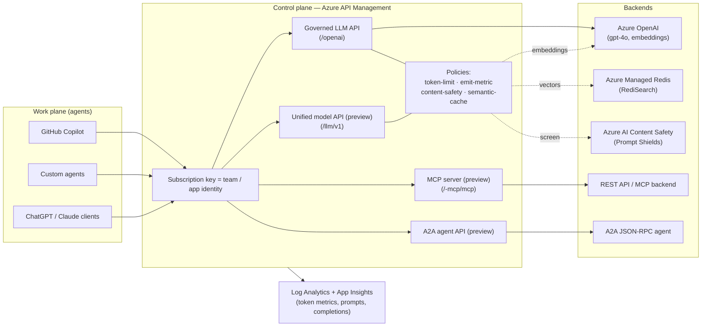

# Architecture — one control plane, three traffic surfaces

## The thesis

The trust boundary moved. Model-level safety governs the *words* a model produces; it cannot govern what an *agent does* — the systems it touches, the data it moves, the actions it takes. Every one of those actions crosses the same chokepoint: the moment the agent reaches out to another system. That chokepoint is the **API gateway**. This repo makes Azure API Management (APIM) that chokepoint, and governs all three kinds of agent traffic through it.

## Two planes

Microsoft's reference design draws a hard line between two layers, and this golden copy enforces it:

- **Rules / control plane — APIM.** Spend caps, identity, content-safety screening, and the audit record. It does not care whether the underlying call is a model call, a tool call, or an agent-to-agent hand-off — the same rules, access controls, and logs cover all three.
- **Work plane — agents and backends.** Where agents run, use tools, and call models.

**The one invariant:** every outbound call goes through the gateway. Agents are never allowed to reach a model or a tool directly. That single rule is what makes the architecture hold up over time — add a new agent platform, model vendor, or tool, and it is governed the day it arrives, because the gateway already sees all the traffic.

## The three surfaces

| Surface | What it is | Governed by | Status |
|---|---|---|---|
| agent → model | LLM API in front of Azure OpenAI | four GA controls | **GA** |
| agent → tool | MCP server (REST API exposed as tools) | rate-limit, identity, trace (whole-server) | **Preview** |
| agent → agent | A2A agent API (JSON-RPC hand-off) | rate-limit, identity, OTel agent attribution | **Preview** |
| one doorway | Unified model API across providers | same policies, format translation | **Preview** |

## Keyless by design

APIM authenticates to every backend with its **system-assigned managed identity** — no API keys live in policies, named values, or config. `infra/modules/rbac.bicep` grants the identity `Cognitive Services OpenAI User` (Azure OpenAI) and `Cognitive Services User` (Content Safety); `disableLocalAuth=true` on both cognitive accounts forbids key auth entirely.

## Where each control lives

| Concern | Mechanism | File |
|---|---|---|
| Spend cap | `llm-token-limit` | `infra/policies/llm-governance.xml` |
| Cost attribution | `llm-emit-token-metric` → App Insights | `infra/policies/llm-governance.xml` |
| Content safety | `llm-content-safety` (Prompt Shields) | `infra/policies/llm-governance.xml` + `modules/content-safety.bicep` |
| Semantic cache | `llm-semantic-cache-*` + Redis | `infra/policies/llm-governance.xml` + `modules/redis.bicep` |
| Team identity | per-team product + subscription key | `infra/modules/products.bicep` |
| Observability | logger + diagnostics | `infra/modules/apim.bicep` + `modules/monitoring.bicep` |

See [maturity-matrix.md](maturity-matrix.md) for GA-vs-preview status and [caveats.md](caveats.md) for the limits that shaped these choices.
