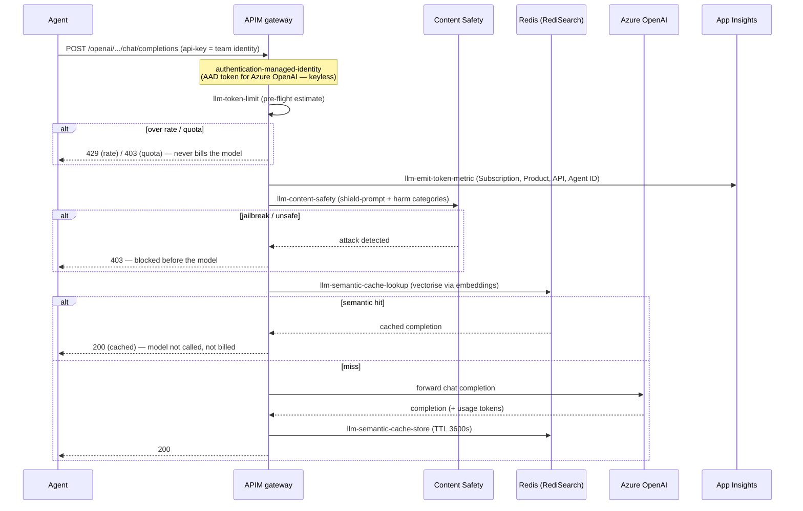

# Request flow — a governed model call

How a single agent → model request is governed end-to-end, in policy order. This is the inbound pipeline from `infra/policies/llm-governance.xml`.

## Why this order

1. **Managed identity first** — attach the keyless AAD token before anything routes to the model.
2. **Token limit before everything billable** — a rejected request piles up against the gate, not the invoice.
3. **Emit metrics** — every request is attributed to a team, hit or miss.
4. **Content safety before cache** — the *incoming* prompt is always screened, even when a cache hit will short-circuit the model. A cached answer was screened when stored; the new prompt still must be.
5. **Cache lookup last (inbound)** — so spend caps, attribution, and safety always evaluate; a hit then saves the backend call.

The trade-off in step 4/5 (screen-before-cache vs cache-before-screen to save the safety call on hits) is deliberate: this golden copy chooses **safety-first**. See [controls/semantic-cache.md](../controls/semantic-cache.md).
