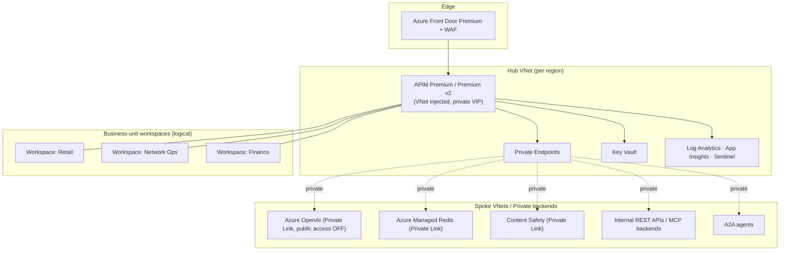

# Enterprise Target Architecture

The production target for this golden copy at global-enterprise scale: tens of thousands of agents, dozens of business units, multi-region, audited, and **every capability toggleable** per environment and per business unit.

This document is the target. The current repo is the GA core seed; [§9 Gap & rollout](#9-gap--rollout) maps seed → target.

---

## 1. Principles

1. **One chokepoint, and it is the only place rules are enforced.** Every call to a model, tool, or agent passes through the API gateway (Azure API Management, "APIM" — the single front door all traffic flows through). At enterprise scale we don't rely on good behaviour to keep it that way; the network enforces it, because the systems behind the gateway have no public address at all (§4).
2. **Central control, local freedom.** A platform team owns the gateway, the policies that apply to every API, and the audit records. Each business unit owns its own APIs and agents inside its own walled-off area (a "workspace"), with permissions scoped to just that area — role-based access control, "RBAC". (§5)
3. **Everything is a switch you can flip.** Each capability is a feature flag with a sensible default per environment and per business unit. A "regulated" setting turns everything on; a "dev" setting is relaxed. (§8)
4. **Layered defence.** Network isolation, identity, content safety, and audit are separate, independent layers. If any one of them fails and lets something through, another catches it and raises an alarm.
5. **Policy is code, and every change is reviewed.** No hand-edits in the production portal. Policy changes go through a reviewed pipeline that previews the effect before applying it and watches for anyone changing things out of band (drift detection). (§7)
6. **Be honest about what is finished.** The production-ready ("generally available", GA) controls do the real work. The not-yet-final ("preview") features — tool governance, agent-to-agent governance, the unified doorway — are kept isolated so that a change to a preview feature can never take down the governance that production depends on.

---

## 2. Reference topology



No backend has a public path. Inbound is private-endpoint or Front-Door-only; public network access is **disabled** on APIM and every cognitive/Redis resource.

---

## 3. Tier decision (the load-bearing choice)

Verified against Microsoft Learn (June 2026):

| Need | Premium (classic) | Premium v2 | Standard v2 |
|---|---|---|---|
| Multi-region active-active | ✅ | ❌ *(not yet on v2)* | ❌ |
| Availability zones | ✅ | ✅ | ❌ |
| VNet injection (full inbound+outbound isolation) | ✅ | ✅ (at create only) | ❌ (integration + private endpoint only) |
| Outbound VNet integration / inbound private endpoint | ✅ | ✅ | ✅ |
| Workspaces (federation) | ✅ | ✅ | ✅ |
| GA AI controls (token-limit, content-safety, cache, metrics) | ✅ | ✅ | ✅ |
| Unified doorway / **Anthropic** governance | ❌ *(v2-only feature)* | ✅ (preview) | ✅ (preview) |
| Self-hosted gateway (hybrid/on-prem/multi-cloud) | ✅ | — | — |

**The unavoidable trade today:** multi-region active-active (Premium classic) **vs** in-gateway multi-provider/Claude (v2). You cannot have both in one instance right now.

**Recommendation:** for a global-enterprise deployment whose first requirement is resilience and global latency, anchor on **Premium (classic), multi-region, zone-redundant, VNet-injected**, and govern OpenAI in-gateway. Add Claude via a **separate v2 instance or a self-hosted/sidecar** behind the same edge until v2 gains multi-region — modelled as the `multiProvider` toggle routing to a v2 backend. Make the tier a parameter so the decision is reversible.

---

## 4. Network isolation (`enableNetworkIsolation`)
The toggle that makes Principle 1 *true* rather than aspirational.
- **Put the gateway inside a private network** (placing the gateway inside a private network — "VNet injection" — on the Premium / Premium v2 tiers) so it has no public address and all its traffic stays private. This can only be set when the gateway is first created, so build it into the very first deployment.
- **Use a private-only connection ("Private Link") and turn public access OFF** on Azure OpenAI, Content Safety, and Azure Managed Redis. Once public access is disabled, the OpenAI endpoint is useless to anyone who isn't on the private path — which closes the bypass risk that exists in the starter version of this repo.
- **Front Door Premium + WAF** at the edge for outside users (Front Door is Azure's global entry point; WAF is its web-application firewall). The gateway sits behind a private connection, which v2 supports when Front Door Premium is in front of it.
- **Network security groups (NSGs)** on every subnet — firewall rules that allow the Storage and Key Vault connections the gateway needs and block traffic out to the internet by default.
- Optionally, a **Network Security Perimeter** drawn around the platform's managed Azure services to give them one trusted boundary.
- The built-in Azure Policy `API Management services should use a virtual network` set to first warn, then block (audit→deny).

## 5. Federation with workspaces (`enableWorkspaces`)
This is how governance works at company scale: the platform stays in central control while each business unit runs its own area. (We call this "federation" — each business unit gets its own walled-off area while the platform keeps central control.)
- One **walled-off area (a "workspace") per business unit or API team**. Each holds that unit's own APIs, product definitions, subscriptions, and stored settings. Access is granted through identity permissions scoped to just that workspace (Entra is Azure's identity service; RBAC is role-based access control — permissions scoped to one area).
- The **platform team** sets the policies that apply to every API — the four AI controls — and every workspace automatically inherits them. Business units can only add their own *narrower* rules on top. A built-in Azure Policy, `API Management policies should inherit parent scope using <base/>`, enforces a required tag (`<base/>`) that makes every unit's policy include the central one, so a unit can't quietly drop a central control.
- **Per-workspace gateways** give the most important business units their own runtime, so a misbehaving Retail agent can't starve Finance's gateway of capacity. Everyone else shares the default gateway.
- Audit visibility is split the same way: each business unit sees only its own logs, while the platform team sees everything, for compliance oversight.

## 6. Identity & access (`identityMode`: `subscription` | `entra` | `both`)
- **Backend auth:** APIM managed identity only; keys disabled. (Seed already does this.)
- **Caller identity:** a subscription key tells us *which team* is calling (for billing); verifying a signed Entra sign-in token (a "JWT") proves *who* is calling, for real security, on the model, tool, and agent surfaces. At enterprise scale, give each agent its own identity so the audit trail attributes an action to *an agent*, not just a team.
- **Tool/A2A authorization:** `validate-jwt` (templated in `mcp-governance.xml` / `a2a-governance.xml`) gating tool and hand-off calls.
- **Gateway access control:** least-privilege roles; the people who write policy aren't the people who deploy it; an emergency-access ("break-glass") account whose elevated rights are granted only just-in-time and time-limited (PIM), with an alert every time it's used.

## 7. Policy lifecycle & CI/CD (`enablePipelineGuardrails`)
- Policies live as code in version control. Each change is peer-reviewed, automatically checked for errors, previewed against the live system to show exactly what it will change (`--what-if`), then rolled out one environment at a time (dev → staging → production).
- **Drift detection** — a scheduled job that compares what is actually running against what the code says it should be. Any hand-edit made in the production portal raises an alarm and is automatically rolled back.
- **Policy tests** — automated tests that fire known bad requests (a jailbreak attempt, an over-budget call, an oversized prompt) at a staging copy and confirm each one is blocked. This is the [smoke-test](../../scripts/smoke-test.sh) suite, run automatically against staging.
- Releases are promoted stage by stage using Azure's deployment tooling for the gateway.

## 8. Secrets & config (`useKeyVault`)
- Anything sensitive — backend connection strings, third-party keys, sign-in-token signing references — is stored in Key Vault (Azure's secrets store) and referenced by name, never pasted in. Secrets can be rotated without redeploying. This repo already uses no keys at all for the Azure AI services; this covers everything else, such as a non-Azure tool's API key sitting behind the gateway.

## 9. Observability → action (`enableSecOpsLoop`)
Telemetry is not governance; the closed loop is.
- Token/prompt/completion logs → Log Analytics; token metrics → App Insights (seed does this).
- Feed logs into **Microsoft Sentinel** (Azure's security-monitoring system that correlates events to spot attacks) and turn on **Defender for APIs** (threat protection for the gateway).
- **Action**, not just dashboards: a budget breach automatically tightens the usage limit; a spike in blocked attacks raises an alert (and can quarantine the surface); unusual per-agent spend is flagged.
- A query-based reporting dashboard per business unit, plus an executive cost view (FinOps = managing cloud spend) breaking spend down by team, agent, and model.

## 10. Data protection (`enablePromptLogging` + `dataMasking`)
Once you log the prompts and responses for audit, protecting that log becomes a data-protection duty in its own right.
- **Data masking** removes personal information from the prompt and response logs before they are ever stored.
- The log store has set rules for how long data is kept and who can read it, with access kept to the minimum needed.
- Data residency: keep the logs — and, where required, customer data — pinned to a specific region. Note the caveat that customer data can be held in only a single region.
- For the most sensitive business units, turn off logging of the prompt and response text entirely and keep only the usage numbers.

---

## AI governance capability catalog

Each is an independent toggle (see [capability-toggles.md](capability-toggles.md)). Grouped by domain:

| # | Domain | Capabilities |
|---|---|---|
| 1 | **Cost / FinOps** | hard token quota · TPM rate limit · pre-flight rejection · semantic cache · per-team/agent attribution · budget alerts → auto-throttle · PTU vs PAYG routing |
| 2 | **Threat / security** | Prompt Shields (jailbreak) · indirect-injection screening · response screening · Defender for APIs · WAF · egress containment |
| 3 | **Identity / access** | managed-identity backends · Entra JWT (model/tool/agent) · per-agent workload identity · workspace RBAC · gateway RBAC + PIM |
| 4 | **Content / safety** | harm categories + thresholds · custom blocklists · request + completion enforcement · per-BU policy overrides |
| 5 | **Data / privacy** | prompt-log masking · retention · residency pinning · log access control · logging on/off per BU |
| 6 | **Tool (MCP)** | tool exposure · rate-limit · identity · agent-id audit · (whole-server scope today) |
| 7 | **Agent-to-agent (A2A)** | hand-off rate-limit · identity · OTel agent attribution |
| 8 | **Model lifecycle** | unified doorway · multi-provider routing · model aliasing · failover pools · version pinning · region routing |
| 9 | **Audit / evidence** | token metrics · prompt/completion logs · Sentinel · per-BU + federated views · immutable audit retention |
| 10 | **Reliability** | multi-region · availability zones · backend load-balanced pools · circuit breakers · retries · capacity autoscale |

---

## 8. The toggle model

```bicep
// infra/config/profiles.bicep (target) — a capability flag set per environment.
@allowed(['dev','test','prod','regulated'])
param profile string

var flags = {
  dev:       { networkIsolation: false, workspaces: false, entraAuth: false, promptLogging: true,  dataMasking: false, secOpsLoop: false, multiRegion: false, multiProvider: false }
  test:      { networkIsolation: true,  workspaces: false, entraAuth: true,  promptLogging: true,  dataMasking: true,  secOpsLoop: false, multiRegion: false, multiProvider: false }
  prod:      { networkIsolation: true,  workspaces: true,  entraAuth: true,  promptLogging: true,  dataMasking: true,  secOpsLoop: true,  multiRegion: true,  multiProvider: false }
  regulated: { networkIsolation: true,  workspaces: true,  entraAuth: true,  promptLogging: false, dataMasking: true,  secOpsLoop: true,  multiRegion: true,  multiProvider: false }
}
```

- Each profile sets the defaults; any individual switch can be overridden on a given deployment. A switch either decides whether a piece of infrastructure gets deployed at all (`module x '...' = if (flags.networkIsolation) {...}`) or whether a piece of policy is included.
- Each business unit can override settings within its own workspace, but only inside the limits the platform team sets: a unit can make a rule *stricter*, never *looser*. The required-tag (`<base/>`) Azure Policy enforces this.
- The full table — switch, what it does, which tier it needs, and whether it is production-ready or preview — is in [capability-toggles.md](capability-toggles.md).

---

## 9. Gap & rollout

Seed (today) → enterprise target, in dependency order. Each step is independently shippable.

| Phase | Adds | Toggles | Why first |
|---|---|---|---|
| 0 (done) | GA core: 4 controls, keyless, per-team products, IaC | — | the chokepoint exists |
| 1 (done) | **Network isolation** (VNet injection + Private Link + public-access-off + WAF) | `networkIsolation` | makes the chokepoint *true*; highest risk if skipped |
| 2 (done) | **CI/CD guardrails** + drift detection + policy tests | `pipelineGuardrails` | so policy-as-code means something; stops portal drift |
| 3 (done) | **SecOps loop** (Sentinel, Defender, budget→throttle, masking) | `secOpsLoop`, `dataMasking` | enforcement, not observation; audit-ready |
| 4 (done) | **Federation** (workspaces per BU, scoped RBAC, `<base/>` Azure Policy) | `workspaces`, `entraAuth` | scales to dozens of BUs without losing central control |
| 5 (done) | **Reliability** (multi-region/AZ, failover pools, capacity/PTU) | `multiRegion`, `availabilityZones`, `modelFailover` | survives a region; tier decision (§3) lands here |
| 6 (done) | **Multi-provider** (unified doorway / Claude, v2 or sidecar) | `multiProvider`, `useKeyVault` | provider independence; preview, isolated |

Compliance obligations satisfied at each phase: [compliance-mapping.md](compliance-mapping.md).

---

## Honest constraints carried into the target
- You cannot today run live in several regions at once *and* govern multiple model providers in the same gateway (§3). That is a current Azure limitation, not a design mistake — revisit it when the v2 tier gains multi-region support.
- Placing the gateway inside a private network can only be done when it is first created (on Premium v2). Get it right on the first deployment, or you have to rebuild.
- Standing up a per-workspace gateway can take hours, so plan business-unit onboarding around that.
- The preview features (per-tool governance, the response side of agent-to-agent, the unified doorway) carry the limitations listed in the [caveats](../caveats.md). That is exactly why they are kept switchable and isolated.
