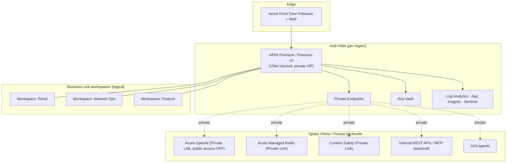

# Enterprise Target Architecture

The production target for this golden copy at global-enterprise scale: tens of thousands of agents, dozens of business units, multi-region, audited, and **every capability toggleable** per environment and per business unit.

This document is the target. The current repo is the GA core seed; [§9 Gap & rollout](#9-gap--rollout) maps seed → target.

---

## 1. Principles

1. **The chokepoint is the only enforcement point.** Every model/tool/agent call transits APIM. At enterprise scale this is enforced by *network*, not honour system: backends have no public path (§4).
2. **Central governance, federated autonomy.** A platform team owns the gateway, the all-APIs policies, and the audit plane. Business-unit teams own their APIs/agents inside **workspaces** with scoped RBAC. (§5)
3. **Everything is a toggle.** Each capability is a feature flag with a per-environment/per-BU default. A "regulated" profile turns everything on; a "dev" profile is permissive. (§8)
4. **Defense in depth.** Network isolation, identity, content safety, and audit are independent layers; any one failing open is caught by another and alarmed.
5. **Policy-as-code, change-controlled.** No portal edits in production. Policy changes flow through a reviewed pipeline with `what-if` and drift detection. (§7)
6. **Honest maturity.** GA controls are load-bearing; preview surfaces (MCP/A2A/unified) are isolated so a preview change can't take down production governance.

---

## 2. Reference topology



No backend has a public path. Inbound is private-endpoint or Front-Door-only; public network access is **disabled** on APIM and every cognitive/Redis resource.

---

## 3. Tier decision (the load-bearing choice)

Verified against Microsoft Learn (June 2026):

| Need | Premium (classic) | Premium v2 | Standard v2 |
|---|---|---|---|
| Multi-region active-active | ✅ | ❌ *(not yet on v2)* | ❌ |
| Availability zones | ✅ | ✅ | ❌ |
| VNet injection (full inbound+outbound isolation) | ✅ | ✅ (at create only) | ❌ (integration + private endpoint only) |
| Outbound VNet integration / inbound private endpoint | ✅ | ✅ | ✅ |
| Workspaces (federation) | ✅ | ✅ | ✅ |
| GA AI controls (token-limit, content-safety, cache, metrics) | ✅ | ✅ | ✅ |
| Unified doorway / **Anthropic** governance | ❌ *(v2-only feature)* | ✅ (preview) | ✅ (preview) |
| Self-hosted gateway (hybrid/on-prem/multi-cloud) | ✅ | — | — |

**The unavoidable trade today:** multi-region active-active (Premium classic) **vs** in-gateway multi-provider/Claude (v2). You cannot have both in one instance right now.

**Recommendation:** for a global-enterprise deployment whose first requirement is resilience and global latency, anchor on **Premium (classic), multi-region, zone-redundant, VNet-injected**, and govern OpenAI in-gateway. Add Claude via a **separate v2 instance or a self-hosted/sidecar** behind the same edge until v2 gains multi-region — modelled as the `multiProvider` toggle routing to a v2 backend. Make the tier a parameter so the decision is reversible.

---

## 4. Network isolation (`enableNetworkIsolation`)
The toggle that makes Principle 1 *true* rather than aspirational.
- **Put the gateway inside a private network** (VNet injection, Premium / Premium v2) so it has no public address and all its traffic stays private. This can only be set when the gateway is first created — bake it into the first deploy.
- **Private Link + public access OFF** on Azure OpenAI, Content Safety, Azure Managed Redis. With public access disabled, the OpenAI endpoint is useless without the private path — the bypass risk in the seed is closed.
- **Front Door Premium + WAF** at the edge for external consumers; private endpoint to the gateway (supported for v2 when fronted by Front Door Premium).
- **NSGs** on every subnet (allow Storage + Key Vault dependencies, deny internet egress by default).
- Optional **Network Security Perimeter** around the PaaS resources for a trusted boundary.
- Azure Policy `API Management services should use a virtual network` enforced in audit→deny.

## 5. Federation with workspaces (`enableWorkspaces`)
The org-scale governance model — central control, BU autonomy.
- One **workspace per business unit / API team**; each holds its own APIs, products, subscriptions, named values. Access via **Entra RBAC scoped to the workspace**.
- The **platform team** applies **all-APIs (global) policies** — the four AI controls — that every workspace inherits; BU teams add only narrower policies. The built-in Azure Policy `API Management policies should inherit parent scope using <base/>` is enforced so a BU can't strip a central control.
- **Workspace gateways** for runtime isolation of mission-critical BUs (a misbehaving Retail agent can't exhaust Finance's gateway); shared default gateway for the long tail.
- Federated observability: each BU sees its own logs; the platform team sees all (compliance oversight).

## 6. Identity & access (`identityMode`: `subscription` | `entra` | `both`)
- **Backend auth:** APIM managed identity only; keys disabled. (Seed already does this.)
- **Caller identity:** a subscription key tells us *which team* is calling (for billing); verifying a signed Entra sign-in token (a "JWT") proves *who* is calling, for real security, on the model, tool, and agent surfaces. At enterprise scale, give each agent its own identity so the audit trail attributes an action to *an agent*, not just a team.
- **Tool/A2A authorization:** `validate-jwt` (templated in `mcp-governance.xml` / `a2a-governance.xml`) gating tool and hand-off calls.
- **Gateway access control:** least-privilege roles; the people who write policy aren't the people who deploy it; an emergency-access ("break-glass") account whose elevated rights are granted only just-in-time and time-limited (PIM), with an alert every time it's used.

## 7. Policy lifecycle & CI/CD (`enablePipelineGuardrails`)
- Policy-as-code in git → PR review → `bicep build` lint → `az deployment ... --what-if` → staged apply (dev → staging APIM → prod).
- **Drift detection**: scheduled compare of live policy vs repo; portal edits in prod alarm and auto-revert.
- **Policy unit tests**: contract tests that fire known payloads (jailbreak, over-cap, oversized) at a staging instance and assert the block — the [smoke-test](../../scripts/smoke-test.sh) suite, run in CI against staging.
- Promote via APIM DevOps Resource Kit / azd environments per stage.

## 8. Secrets & config (`useKeyVault`)
- All config-as-secret (any backend connection strings, third-party keys, JWT signing references) via **Key Vault references** in named values; rotation without redeploy. The seed is already keyless to cognitive services; this covers everything else (e.g., a non-Azure tool's API key behind the gateway).

## 9. Observability → action (`enableSecOpsLoop`)
Telemetry is not governance; the closed loop is.
- Token/prompt/completion logs → Log Analytics; token metrics → App Insights (seed does this).
- Feed logs into **Microsoft Sentinel** (Azure's security-monitoring system that correlates events to spot attacks) and turn on **Defender for APIs** (threat protection for the gateway).
- **Action**, not just dashboards: a budget breach automatically tightens the usage limit; a spike in blocked attacks raises an alert (and can quarantine the surface); unusual per-agent spend is flagged.
- A query-based reporting dashboard per business unit, plus an executive cost view (FinOps = managing cloud spend) breaking spend down by team, agent, and model.

## 10. Data protection (`enablePromptLogging` + `dataMasking`)
Logging prompts/completions for audit *is* a data-protection obligation.
- Diagnostic **data masking** on prompt/completion logs (PII redaction) before they land.
- Retention + access policy on the Log Analytics workspace; least-privilege on audit data.
- Data-residency: pin logging + (where required) customer data to region; note the single-region customer-data caveat.
- Toggle off prompt-body logging entirely for the most sensitive BUs (keep metrics only).

---

## AI governance capability catalog

Each is an independent toggle (see [capability-toggles.md](capability-toggles.md)). Grouped by domain:

| # | Domain | Capabilities |
|---|---|---|
| 1 | **Cost / FinOps** | hard token quota · TPM rate limit · pre-flight rejection · semantic cache · per-team/agent attribution · budget alerts → auto-throttle · PTU vs PAYG routing |
| 2 | **Threat / security** | Prompt Shields (jailbreak) · indirect-injection screening · response screening · Defender for APIs · WAF · egress containment |
| 3 | **Identity / access** | managed-identity backends · Entra JWT (model/tool/agent) · per-agent workload identity · workspace RBAC · gateway RBAC + PIM |
| 4 | **Content / safety** | harm categories + thresholds · custom blocklists · request + completion enforcement · per-BU policy overrides |
| 5 | **Data / privacy** | prompt-log masking · retention · residency pinning · log access control · logging on/off per BU |
| 6 | **Tool (MCP)** | tool exposure · rate-limit · identity · agent-id audit · (whole-server scope today) |
| 7 | **Agent-to-agent (A2A)** | hand-off rate-limit · identity · OTel agent attribution |
| 8 | **Model lifecycle** | unified doorway · multi-provider routing · model aliasing · failover pools · version pinning · region routing |
| 9 | **Audit / evidence** | token metrics · prompt/completion logs · Sentinel · per-BU + federated views · immutable audit retention |
| 10 | **Reliability** | multi-region · availability zones · backend load-balanced pools · circuit breakers · retries · capacity autoscale |

---

## 8. The toggle model

```bicep
// infra/config/profiles.bicep (target) — a capability flag set per environment.
@allowed(['dev','test','prod','regulated'])
param profile string

var flags = {
  dev:       { networkIsolation: false, workspaces: false, entraAuth: false, promptLogging: true,  dataMasking: false, secOpsLoop: false, multiRegion: false, multiProvider: false }
  test:      { networkIsolation: true,  workspaces: false, entraAuth: true,  promptLogging: true,  dataMasking: true,  secOpsLoop: false, multiRegion: false, multiProvider: false }
  prod:      { networkIsolation: true,  workspaces: true,  entraAuth: true,  promptLogging: true,  dataMasking: true,  secOpsLoop: true,  multiRegion: true,  multiProvider: false }
  regulated: { networkIsolation: true,  workspaces: true,  entraAuth: true,  promptLogging: false, dataMasking: true,  secOpsLoop: true,  multiRegion: true,  multiProvider: false }
}
```

- Profiles set defaults; individual flags override per deploy. Each flag gates **conditional module deployment** (`module x '...' = if (flags.networkIsolation) {...}`) and/or **policy fragment inclusion**.
- Per-BU overrides live in the workspace layer, within guardrails the platform team sets (a BU can be *stricter*, never *looser* — enforced by the `<base/>`-inheritance Azure Policy).
- The full flag → capability → tier-requirement → GA/preview matrix is in [capability-toggles.md](capability-toggles.md).

---

## 9. Gap & rollout

Seed (today) → enterprise target, in dependency order. Each step is independently shippable.

| Phase | Adds | Toggles | Why first |
|---|---|---|---|
| 0 (done) | GA core: 4 controls, keyless, per-team products, IaC | — | the chokepoint exists |
| 1 (done) | **Network isolation** (VNet injection + Private Link + public-access-off + WAF) | `networkIsolation` | makes the chokepoint *true*; highest risk if skipped |
| 2 (done) | **CI/CD guardrails** + drift detection + policy tests | `pipelineGuardrails` | so policy-as-code means something; stops portal drift |
| 3 (done) | **SecOps loop** (Sentinel, Defender, budget→throttle, masking) | `secOpsLoop`, `dataMasking` | enforcement, not observation; audit-ready |
| 4 (done) | **Federation** (workspaces per BU, scoped RBAC, `<base/>` Azure Policy) | `workspaces`, `entraAuth` | scales to dozens of BUs without losing central control |
| 5 (done) | **Reliability** (multi-region/AZ, failover pools, capacity/PTU) | `multiRegion`, `availabilityZones`, `modelFailover` | survives a region; tier decision (§3) lands here |
| 6 (done) | **Multi-provider** (unified doorway / Claude, v2 or sidecar) | `multiProvider`, `useKeyVault` | provider independence; preview, isolated |

Compliance obligations satisfied at each phase: [compliance-mapping.md](compliance-mapping.md).

---

## Honest constraints carried into the target
- The **multi-region vs multi-provider** tier conflict (§3) is a current Azure limit, not a design miss. Revisit when v2 ships multi-region.
- VNet **injection is create-time only** (Premium v2) — get it right on first deploy or rebuild.
- Workspace **gateway provisioning can take hours**; plan BU onboarding accordingly.
- Preview surfaces (MCP per-tool scope, A2A response-side, unified doorway) carry the [caveats](../caveats.md); they're toggled and isolated for that reason.
